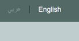

# robot-control

<!-- PROJECT IMAGE -->

<!-- TABLE OF CONTENTS -->
## Table of Contents

* [About the Project](#about-the-project)
* [Interface](#interface)
* [Database](#database)
* [Implementation](#implementation)
  * [Buttons](#buttons)
  * [Files](#files)

<!-- ABOUT THE PROJECT -->
## About The Project
The aim of this project is to control a robotic arm and to control a robot's move remotely without the need for direct intervention. In order to achieve this, a web interface has been designed to helps the user control the robotic arm. Moreover, this project relied on databases in the process of communication between hardware components and commands sent from a web page by PHP.

<!-- INTERFACE -->
## Interface
The interface is designed in a simple way for ease of use. It also met the main things (such as: the angle for the six motors, run button, save button, and direction of move, etc.) see figure 1.

    

        figure 1: Interface.
    

     

    
    

        figure 2: Mobile web interface.
    

In the interface, the gif and image are used to make the current state of the robot visible to the user. see figure 3,4,5,6,7, and 8

     
    figure 3: Stop state. 
     
    figure 4: Start stat. 
     
    figure 5: Forward move. 
     
    figure 6: Left move. 
     
    figure 7: Right move. 
     
    figure 8: Backward move. 

<!-- DATABASE -->
## Database
This project only needs to design four tables. The first one is to save angles (Table 1), the second is to save start and stop operations(angles) (Table 2), the third is to save the current state for the robot (Table 3), and the last one is to save the last action performed (Table 4).
 

 Table 1: arm angle.

| Attribute |            Description              | Datatype | PK |
|:---------:|:-----------------------------------:|:--------:|:--:|
|    id     | this id used to determine which arm |  integer | yes |
|   motor1  | the number of the angle for motor 1 |  integer | no |
|   motor2  | the number of the angle for motor 2 |  integer | no |
|   motor3  | the number of the angle for motor 3 |  integer | no |
|   motor4  | the number of the angle for motor 4 |  integer | no |
|   motor5  | the number of the angle for motor 5 |  integer | no |
|   motor6  | the number of the angle for motor 6 |  integer | no |
 

 Table 2: start/stop.

| Attribute |            Description              | Datatype | PK |
|:---------:|:-----------------------------------:|:--------:|:--:|
|    id     | this id used to determine which arm |  integer | yes |
|   on_off  |    show the last command (on/off)   |  integer | no |
 

 Table 3: Moves table.

| Attribute |                   Description                      | Datatype |  PK |
|:---------:|:--------------------------------------------------:|:--------:|:---:|
|    id     |       This id used to determine which arm          |  integer | yes |
|    run    | Used to check whether the robot has started or not |  string  | no  |
|    move   |      Used to store the direction of movement       |  string  | no  |
 

 Table 4: Last move table.

| Attribute |            Description              | Datatype |  PK |
|:---------:|:-----------------------------------:|:--------:|:---:|
|    id     | This id used to determine which arm |  integer | yes |
|   action  |    Used to store the last action    |  string  | no  |

<!-- IMPLEMENTATION -->
## Implementation
This section explains what each button does and explains the implementation of the files.

<!-- BUTTONS -->
### Buttons
- save button: Used to save the angles in the database (figure 9).
- reset button: Used to reset the value to the main value (figure 9).
- on/off button: Used to save the angle action in the database (figure 9).
- forward, left, right, backward button: Used to Used to give a command to move in the specified direction (figure 9).
- start/stop button: Used to  give a command to start/stop move (figure 9).
- عربي/english button: Used to change the language (figure 10).

    
     
    figure 9: buttons

    
     
    figure 10: Language button

<!-- FILES -->
### Files
- angles.php, runAngles.php, moves.php, and runMoves.php: Used to store data in the specified table. angles.php to store angles, runAngles.php to store run and stop operation(for angles),  moves.php to store move and run state, and runMoves.php to store start and stop operation(for move).
- runAnglesInfo.php, and runMovesInfo.php: Used to return a json file to the javascript file with information about the whether the arm and robot are already run or not and .
- anglesInfo.php, and movesInfo.php: Used to give information about the current arm(anglesInfo.php) and information about the current robot(movesInfo.php). (php page to share data with the hardware).
- index.html: Contains the main page interface.
- index.css: Used to improve the interface.
- index.js: This file is responsible for converting the language of the main page (arabic/english). Moreover, it is responsible for taking the response from the (runAnglesInfo.php and runMovesInfo.php) file in order to change the necessary parts of the main page. Furthermore, it responsible for transferring data to the php files.
